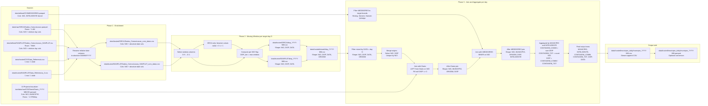

# Pipeline Mermaid Flow

```mermaid
flowchart LR

  subgraph S[Sources]
    ORCA_RAW[data/raw/ORCA/Dados_Comunicacao.parquet\nRows: ~1.4M\nCols: NIO + relative day cols]
    SAN_RAW[data/refined/SANPLAT/Dados_Comunicacao_SANPLAT.csv\nRows: ~584K\nCols: NIO + relative day cols]
    ORCA_REF[data/trusted/CIS/Data_Referencia.csv\n1 row / 1 date]
    SAN_REF[data/trusted/SANPLAT/Data_Referencia_2.csv\n1 row / 1 date]
    DIARIO[D:/Projects/visualizer-tuis/data/raw/CIS/Diario/Diario_YYYY-MM-DD.parquet\nCols: NIO, MUNICIPIO\nRows: ~1.97M/day]
    MED[data/refined/CIS/MEDIDORES.parquet\nCols: NIO, INTELIGENTE brand]
  end

  subgraph P1[Phase 1 - Enrichment]
    E1[Rename relative date columns\nto absolute DD/MM/YYYY]
    ORCA_ENR[data/trusted/ORCA/Dados_Comunicacao_com_datas.csv\nCols: NIO + absolute date cols]
    SAN_ENR[data/trusted/SANPLAT/Dados_Comunicacao_SANPLAT_com_datas.csv\nCols: NIO + absolute date cols]
  end

  ORCA_RAW --> E1
  SAN_RAW --> E1
  ORCA_REF --> E1
  SAN_REF --> E1
  E1 --> ORCA_ENR
  E1 --> SAN_ENR

  subgraph P2[Phase 2 - Moving Window per target day D]
    W1[Select window columns\nD-5 .. D-1]
    W2[ORCA only: binarize values\nvalue > 0 => 1]
    W3[Compute per-NIO flag\nDISP_bin = max window]
    ORCA_DISP[data/trusted/ORCA/disp_YYYY-MM.csv\nShape: NIO, DISP, DATA]
    SAN_DISP[data/trusted/SANPLAT/disp_YYYY-MM.csv\nShape: NIO, DISP, DATA]
    MIXED[data/trusted/mixed/disp_YYYY-MM.csv\nShape: NIO, DISP, DATA, ORIGEM]
  end

  ORCA_ENR --> W1
  SAN_ENR --> W1
  W1 --> W2 --> W3
  W1 --> W3
  W3 --> ORCA_DISP
  W3 --> SAN_DISP
  ORCA_DISP --> MIXED
  SAN_DISP --> MIXED

  subgraph P3[Phase 3 - Join and Aggregate per day]
    D1[Filter mixed by DATA = day D\nShape: NIO, DISP, DATA, ORIGEM]
    D2[Merge origins\nSelect NIO, DISP\nUnique by NIO]
    J1[Join with Diario\nLEFT from Diario on NIO\nFill null DISP => 0]
    SH1[After Diario join\nShape: NIO, MUNICIPIO, ORIGEM, DISP]
    F1[Filter MEDIDORES to target brands\nHexing, Nansen, Nansen Ipiranga]
    J2[Join with MEDIDORES\nINNER on NIO]
    SH2[After MEDIDORES join\nShape: NIO, MUNICIPIO, ORIGEM, DISP, INTELIGENTE]
    A1[Aggregate by MUNICIPIO and INTELIGENTE\nCONTAGEM_COMM = sum DISP\nCONTAGEM_TOT = count NIO\nDISP = CONTAGEM_COMM / CONTAGEM_TOT]
    OUT[Final output rows\nMUNICIPIO, INTELIGENTE, CONTAGEM_COMM, CONTAGEM_TOT, DISP, DATA]
  end

  MIXED --> D1 --> D2 --> J1 --> SH1
  DIARIO --> J1
  MED --> F1 --> J2
  SH1 --> J2 --> SH2 --> A1 --> OUT

  subgraph SINK[Output sink]
    CSV[data/trusted/municipio_daily/municipio_YYYY-MM.csv\nStream append CSV]
    PARQ[data/trusted/municipio_daily/municipio_YYYY-MM.parquet\nOptional conversion]
  end

  OUT --> CSV --> PARQ
```
